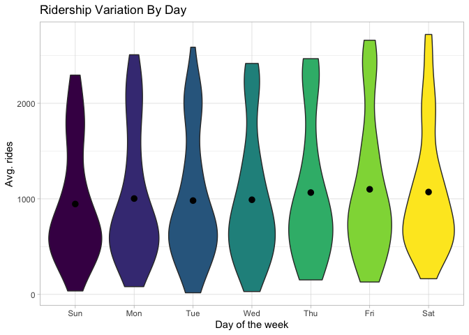
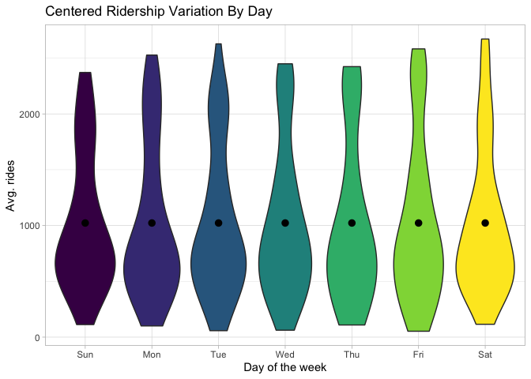
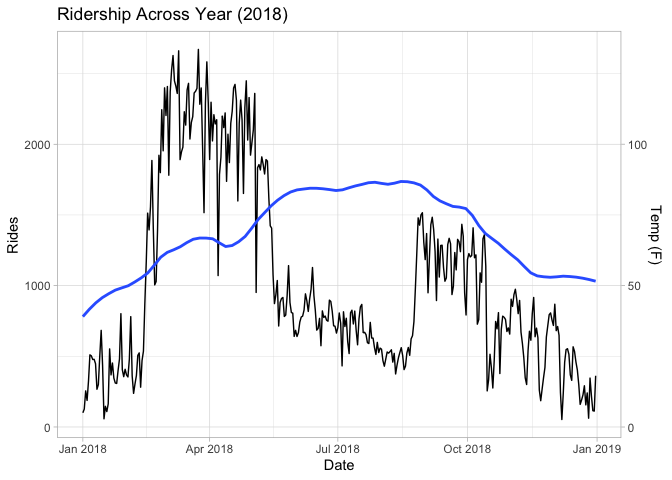
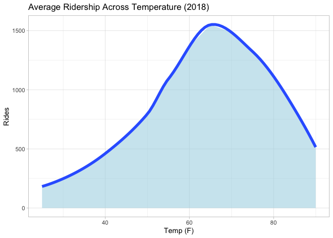
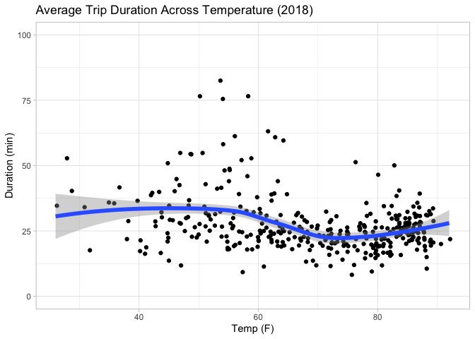
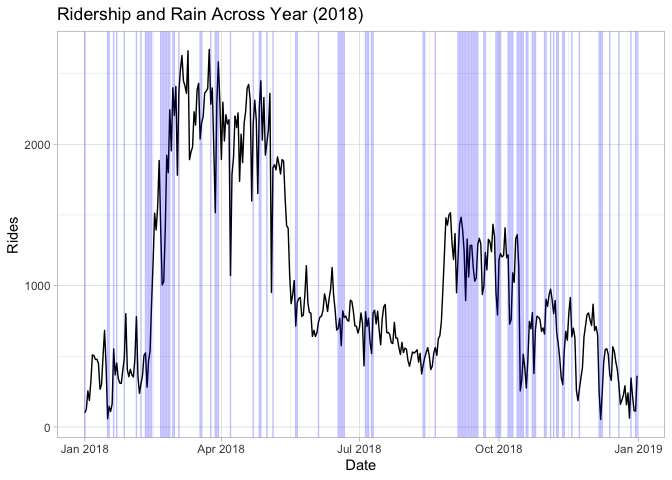
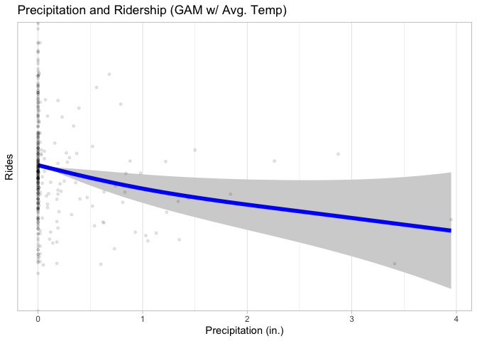
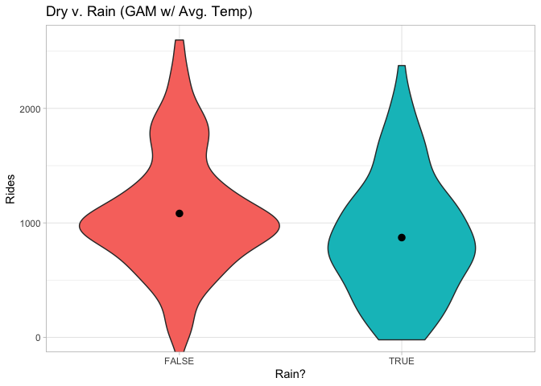
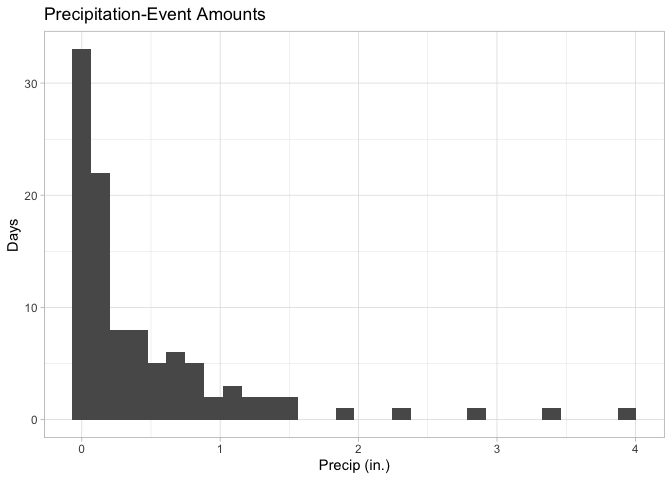

Capstone Bikeshare
================
Madison
10/6/2021

### The story

It is early 2019. A completely hypothetical bikeshare company in Austin
has slowly begun to fall behind. Unable to compete in the raw numbers
game of spatial saturation, are there other options that the business
can pivot towards? The executive team makes the rational call to focus
where the company can specialize and capture a market-segment before the
competitors win with their relentless frenzied assault on every street
corner in the 512-area. After brainstorming with other stakeholders, the
initial point of focus to find openings regarding Austin’s unique
weather. The data team (lead, junior, and contracted analysts Madison,
Maddy, and “Mad”), is tasked with finding the decisive evidence to guide
the stakeholders.

### Basic Question

How does weather affect rider frequency and behavior?

What are the basic cost/benefit scenarios? How many users are needed to
break even?

### Conclusion

Both temperature and precipitation have statistically significant,
non-linear relationships with ridership, and temperature is by far the
more dominant explanatory variable of the two.

High and low seasonal temperatures dramatically decrease ridership.

Considerable temperature-related variation in ridership leaves us open
to many potential moves that can improve both ridership as well as
profit generation. Further investigation into potential exploits are
recommended.

Precipitation has only a minimal effect even when seasonality is
accounted for. Possibly reflective of notable rain events (ex. &gt;0.5
in.) being rare.

The subtle effect of precipitation, however, does not leave much obvious
opportunity. Only a potential exploratory survey regarding potential
rain-related hesitancy can be recommended.

### Process

To answer these questions, we need *data* and ideas based on what that
data tells us.

##### Cleanup

Using the public data sets in BigQuery, the relevant Austin bike sharing
dataset is pulled for the year 2018.

``` sql
SELECT trip_id,
bikeid AS bike_id, -- keep naming consistent
start_time,
duration_minutes,
FROM `bigquery-public-data.austin_bikeshare.bikeshare_trips`
WHERE EXTRACT(year FROM start_time) = 2018 
  AND (start_station_id != SAFE_CAST(end_station_id AS INT64) 
  OR duration_minutes > 1)
```

A quick look at the data preview showed that there were often
entry-related errors with bikes that would be un-docked and re-docked
without going anywhere within 1 minute intervals. These were removed.

The resulting 300,000+ rows of data are saved and loaded into R-Studio.

``` r
library("tidyverse")
library("lubridate")
library("mgcv")
library("mgcViz")

# data cleanup
rs <- read.csv("rideshare_data_2018.csv")
rs$bike_id <- as.integer(rs$bike_id)
rs$start_time <- as.Date(rs$start_time)
```

Evaluating and cleaning up the data

``` r
sum(is.na(rs))
```

    ## [1] 6753

Thats a lot of NAs, lets so what the deal is.

``` r
which(is.na(rs), arr.ind = TRUE) # all NAs are apparently in bike_id

rs$bike_id <- NULL # since bike_id is not relevant for this particular investigation, it is dropped
```

``` r
sum(is.na(rs)) # No more NAs
```

    ## [1] 0

``` r
summary(rs$duration_minutes)
```

    ##     Min.  1st Qu.   Median     Mean  3rd Qu.     Max. 
    ##     0.00     5.00     8.00    24.92    21.00 12496.00

Several hundred outliers (representing &lt;0.01 of trips) existed within
durations. Given that policies of bike sharing companies at the time
never allowed more than 3 days for special weekend passes, these entries
are flat-out errors or possibly lost-then-found bikes and should be
removed. All entries exceeding 3 days (4320 minutes) are dropped.

``` r
rs <- rs[rs$duration_minutes <= 4320,]

rs <- rs[order(rs$start_time),]
```

``` r
ct <- count(rs, rs$start_time)
ag <- aggregate(rs$duration_minutes ~ rs$start_time, FUN=mean)
tr <- merge(ct, ag, "rs$start_time", all=FALSE)

tr <- rename(tr, date = "rs$start_time", rides = "n", avg_length = "rs$duration_minutes")
```

The data is transformed to show day-to-day data rather than individual
trips.

    ##         date rides avg_length
    ## 1 2018-01-01    81   48.81481
    ## 2 2018-01-02    86   35.59302
    ## 3 2018-01-03   223   29.39013
    ## 4 2018-01-04   231   27.80952
    ## 5 2018-01-05   402   24.98756
    ## 6 2018-01-06   559   33.21825

Rather dirty weather data is pulled from NOAA servers for Austin TX.
Irrelevant/duplicate data are removed and a few NAs are dropped
(possibly correlating with station maintenance?), and the sets are
merged.

``` r
wd <- read.csv("noaa_austin_2018.csv")
wd <- rename_with(wd, tolower)

wd$station <- NULL # Removal of unnecessary data
wd$snow <- NULL
wd$tmin <- NULL
wd$tavg <- NULL
wd$tmax <- NULL

wd <- na.omit(wd)

wd <- distinct(wd) 
wd <- wd[!duplicated(wd$date),]


wd$date <- as.Date(wd$date)
wd$rain <- c(ifelse(wd$prcp != 0.00, TRUE, FALSE)) # Creation of a boolean category for whether there was any precipitation or not.

td <- read.csv("noaa_austin_temps_2018.csv")
td <- rename_with(td, tolower)

td$station <- NULL
td$tobs <- NULL

td <- na.omit(td)
td <- distinct(td)
td <- td[!duplicated(td$date),]


td$date <- as.Date(td$date)

wd <- merge(wd, td, by = "date", all=FALSE)

cd <- merge(wd, tr, by = "date", all = FALSE) # combining precipitation and bike data
```

    ##         date prcp  rain tavg tmax tmin rides avg_length
    ## 1 2018-01-01 0.06  TRUE   28   32   24    81   48.81481
    ## 2 2018-01-02 0.00 FALSE   29   32   23    86   35.59302
    ## 3 2018-01-03 0.00 FALSE   31   56   15   223   29.39013
    ## 4 2018-01-04 0.00 FALSE   36   54   22   231   27.80952
    ## 5 2018-01-05 0.00 FALSE   49   61   35   402   24.98756
    ## 6 2018-01-06 0.00 FALSE   45   64   29   559   33.21825

##### Adjustments

A key issue to be wary of is that ridership and duration vary slightly
and predictably by day of the week; especially weekends.

<!-- -->

Weekdays are marked and a boolean for weekends is created.

``` r
cd$weekday <- wday(cd$date, label=TRUE) # ordinal 3-letter days
cd$is_weekend <- c(ifelse(wday(cd$date) == 1 | wday(cd$date) == 7, TRUE, FALSE))
```

Now, we can center the means:

``` r
ar <- mean(cd$rides)
al <- mean(cd$avg_length)
cd <- cd %>% group_by(weekday) %>% mutate(n_rides = scale(rides, scale=FALSE) + ar, n_length = scale(avg_length, scale=FALSE) + al)
```

The result is data that can be less confounded by arbitrary variations
in date. <!-- -->

#### Analysis

The first stop of interest is season. There are obvious differences in
all 4 seasons, with spring and fall having higher ridership than summer
and winter. While we could offer seasonally painted bikes and call it a
day,there are probably more fruitful avenues to look further into. What
divides the seasons? Temperature and precipitation. Given Austin is
relatively dry throughout the year, lets start with temperature.

<!-- --><!-- --><!-- -->
(See below for statistics test)

##### Findings and Recommendations 1

The main point of interest is that seasonal temperatures account for a
difference of roughly 1,000 in ridership. Efforts could be made to
either diminish the drops on the extremes or boost the peak would be
reasonable.

One particularly interesting suggestion is offering water-bottle refill
stations. This takes advantage of the fact that:

-   Bicyclists are likely to already carry water-bottles
-   Bikes are already marketed as a “green” method of travel which
    refill stations are associated with
-   Adding refill stations would slot in cheaply with existing
    maintenance operations

The result would be an edge of better customer service and practical
utility for customers. Off-the-shelf stands/despensors can be easily
added at bike-stations, cheap public utilities can be used if available,
or a relatively standard tank-storage system can also be used. The
service can be protect and directly generate profit either by a user
cost, a “app proximity key” on user smartphones, or a combination of the
two.

Further user surveys would be helpful for gauging potential usage, as
well as researching relevant law and regulations.

#### Analysis 2

The next seasonal difference is rain. Rain is heavily confounded by
temperature as peak ridership occurs during seasons that bring both
moderate temps but also rain.

<!-- -->

Gam() is used to account for average temperature and precipitation to
reveal the underlying relationship.

``` r
g <- gam(cd$n_rides ~ s(cd$tavg) + s(cd$prcp), data = cd)
```

<!-- --><!-- -->

    ## 
    ## Family: gaussian 
    ## Link function: identity 
    ## 
    ## Formula:
    ## cd$n_rides ~ s(cd$tavg) + s(cd$prcp)
    ## 
    ## Parametric coefficients:
    ##             Estimate Std. Error t value Pr(>|t|)    
    ## (Intercept)  1022.69      28.01   36.51   <2e-16 ***
    ## ---
    ## Signif. codes:  0 '***' 0.001 '**' 0.01 '*' 0.05 '.' 0.1 ' ' 1
    ## 
    ## Approximate significance of smooth terms:
    ##              edf Ref.df      F p-value    
    ## s(cd$tavg) 5.860  6.996 29.206 < 2e-16 ***
    ## s(cd$prcp) 1.465  1.774  4.812 0.00789 ** 
    ## ---
    ## Signif. codes:  0 '***' 0.001 '**' 0.01 '*' 0.05 '.' 0.1 ' ' 1
    ## 
    ## R-sq.(adj) =   0.36   Deviance explained = 37.3%
    ## GCV = 2.9313e+05  Scale est. = 2.8644e+05  n = 365

Here we see that there is a subtle-but-statistically significant
relationship between precipitation. Precipitation, while correlating
with periods of high ridership, depresses the relative ridership.

##### Findings and Recommendations 2

One possible suggestion is the inclusion of rain-poncho dispensers at
bike stations. Intuitively, however, that suggestion seems lack luster.
Firstly, Austin is relatively dry, and most precipitation events are
&lt; 0.5 in.. Secondly, the depreciation on ridership is small as
described above.

<!-- -->

A quick best-case cost-benefit analysis makes it clear that such a plan
is DoA:

-   Number of stations to be outfitted (50 total)
-   Cost of a poncho vending machine ($350 a month ea.)
-   Cost of a poncho + maintenance (bulk price \~$0.20)
-   Price of a poncho ($1.99 based on another team’s research)
-   How many will be purchased

(1.99 − 0.2)*x* − (50 \* 350) Thus 117,324 units per month will need to
be purchased for all stations.

The average rainy day has 250 less riders, so, assuming a miraculous
100% usage for even a drop of rain, only 25,750 units would end up sold.
Far less than our break even amount.

Lastly, including many disposable plastic tarps probably would damage
the eco-friendly aspect of the brand. A hard sell to the brand
management team.

The only possible caveat here is that the availability of ponchos could
help subside a general “weather anxiety” that increases new ridership,
if such a phenomenon exists. The only recommendation thus is an
exploratory survey of non-users.
